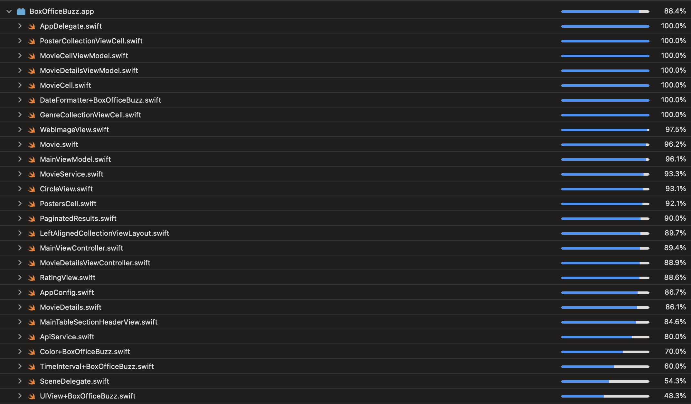
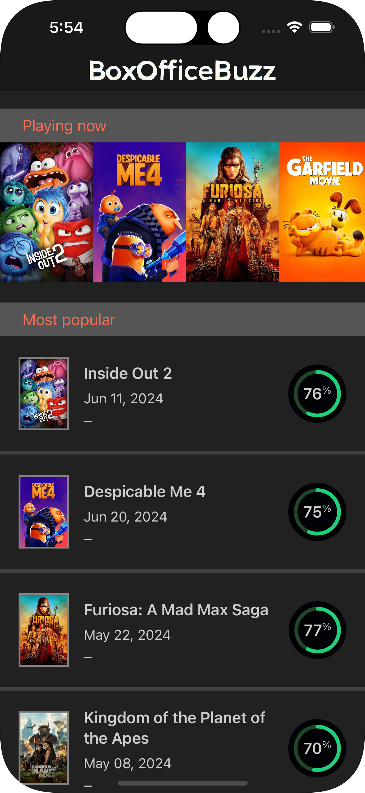
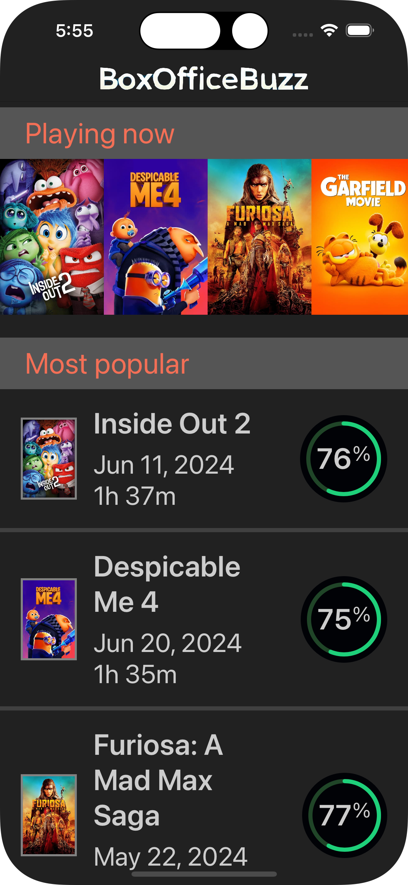
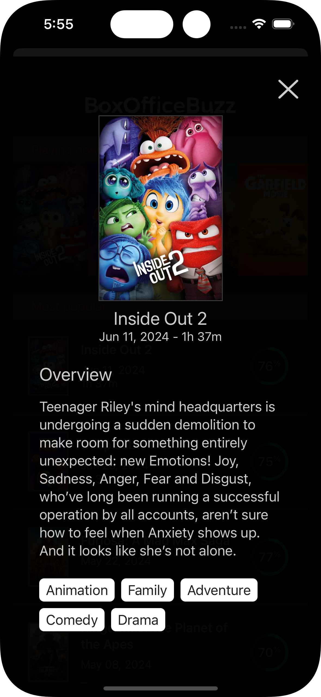
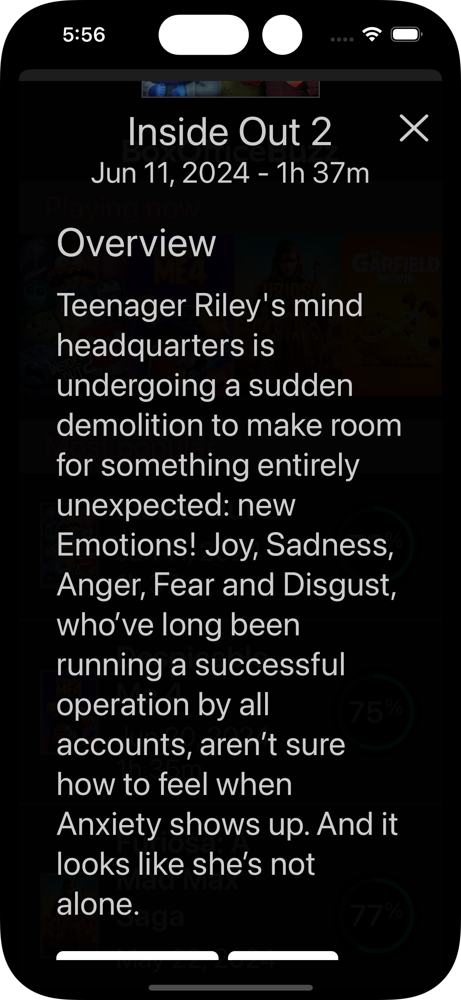

# BoxOfficeBuzz

App that fetches Movies and display in a list.

## Instructions

1. Clone the repo, install dependencies (SPM).
2. Register for an API key at [TMDB](https://www.themoviedb.org/).
3. Add the APIkey in the [AppConfig.swift](./BoxOfficeBuzz/AppConfig.swift).

## Project basics

* `MVVM` architecture
* The app is accessible and uses dynamic type, so it respects the user configuration for larger font sizes. Please check it out using the `Accessibility Inspector`
* Unit tests, UI tests and Test Coverage reports.
* 2 external dependencies:
  * `SwiftLint`
  * `Swifter`: local web server used for the UI tests
* Images and colours used are in an asset catalog
* Caching using URLCache
* Loading and error states were not implemented
* The application was developed in portrait mode only

## Documentation

You can find the project documentation [here](./documentation/).

## Test Coverage Report

## Screeen Shots

|        Screen         |       iPhone 15 Pro       |       iPhone 15 Pro Large Text |
|:---------------------:|:---------------------:|:---------------------:|
| Main| |  |
| Details| | |
